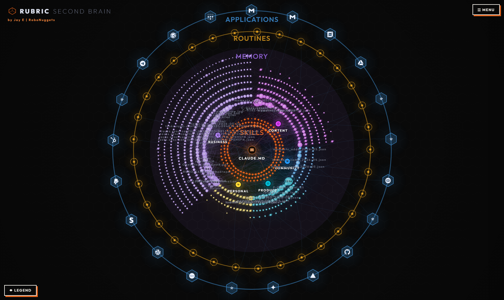

# Rubric Second Brain

A live map of your entire agent workspace - every file, skill, routine and connected app as one navigable brain - plus **brain.js**, the zero-token retrieval and storage engine underneath it. Built by [Jay E | RoboNuggets](https://skool.com/robonuggets). License: CC BY 4.0.

---

## FOR THE AGENT - read this whole file before touching anything

You are setting this up for **your** user, inside **their** workspace.

**Prime directive: respect the workspace you find.** Do not restructure their folders, do not rename their conventions, do not force Jay's layout onto them. Your job is to *map what exists*. Jay's setup (described near the end) is a reference to compare against - if the user's workspace lacks a convention this system needs, *propose* it and let them decide.

Everything is configured through `config/*.json` - you should not need to edit engine code for a normal setup.

---

## The 3 steps

Tell your user this plan up front, then execute:

**Step 1 · Scan** - you map the workspace: skills, documents, routines, connectable apps - and propose their departments. (No questions needed here; all of this is discoverable.)

**Step 2 · Confirm** - present the proposal in one message: departments with names and colours, the apps list, the routines list, memory location. The user approves or tweaks. Then you generate their icons and personalize the page subtitle.

**Step 3 · Launch** - start the server, open the brain in the browser. That's the finish line: the user sees their whole workspace as one living map.

---

### Step 1 in detail - what to look for

Fill `config/workspace.json` first (`root` is relative to this repo folder; all other paths are relative to that root):

| Field | How to find it |
|---|---|
| `root` | Where the workspace root is relative to this folder (usually `..` if placed inside the workspace) |
| `skillDirs` | Where skills/commands live (`.claude/skills`, `.claude/commands`, or their equivalent) |
| `memoryDir` + `memoryIndex` | Their memory folder and its index file, if they have one |
| `projectsDir` | Their projects folder, if any |
| `sharedPrefixes` | Prefixes synced/shared beyond this machine (drives access colouring) |
| `visibleRoots` | Folders whose direct children show by default (pick their 5-9 most meaningful dirs) |
| `routing` | Which root doc owns which topic - map each of their always-loaded docs to its topic words (used by `brain.js recall`) |

Then discover, with evidence, and fill the other configs:

- **Departments** (`departments.json`): propose **3-6** from real structure - project prefixes, top-level folders, how their docs cluster. Fill `projectPrefixes`, `pathRules`, `memoryKeywords` so every file lands somewhere; set `default` to their catch-all. Colours: saturated, clearly distinct from each other and from the four layer colours.
- **Applications** (`apps.json`): only REAL connections - MCP servers in their config, CLIs authenticated against a service (`gh`, `vercel`, cloud CLIs...), APIs with stored credentials. **Local runtimes and tools (node, python, ffmpeg, git-the-binary) do not belong here.** When in doubt, ask: "does this talk to something outside this machine?"
- **Routines** (`routines.json`): anything on a schedule - OS schedulers (cron, Windows Task Scheduler), agent-app scheduled tasks, cloud crons (GitHub Actions and similar), and skills the user fires on a rhythm.
- **Agents** (`agents.json`): optional. A VPS/edge agent gets `kind: "vps"`, `access: "synced"` (its reach is computed from `sharedPrefixes`). Scoped helpers get explicit skill/memory grant lists.

### Step 2 in detail - confirm, then icons

Present the whole proposal in ONE message and wait for approval. After approval:

**Icon principles** (make them yourself - these rules, not templates):

1. **Department hub icons** are engine line-art keys - set `icon` to one of: `build`, `pen`, `people`, `coin`, `data`, `pulse`, `book`, `clock`, `visual`, `api`.
2. **App brand icons** are single-path 24x24 SVG fills keyed by app id in `BRAIN_ICON_PATHS` at the bottom of `public/_icons.js`. Source the official brand path (simple-icons style: one `d="..."` path, 24x24 viewBox) and add `'app:<id>': '<path d>'`. Twenty-two common brands are already baked in - reuse their ids where they match (see `apps.json` samples).
3. **Custom app/routine glyphs** are small stroke SVGs in `BRAIN_ICONS` in the same file: 48x48 viewBox, `stroke="#888"` (recoloured at draw time), `stroke-width="2"`, round caps, **2-5 elements maximum**, one clear metaphor per icon. Test legibility at 24px - if you can't tell what it is that small, simplify.

Then personalize the subtitle: in `public/index.html`, find the line marked `STEP 2: personalize` and put the user's name in it.

### Step 3 in detail - launch

```
node server.js        # scans the workspace, serves the brain
# open http://localhost:5210
```

Smoke-test the engine too:

```
node brain.js recall "any question about a stored fact"
node brain.js store "test fact" --type reference --name smoke-test --sandbox
```

The finish line is the visual open in the browser showing their real workspace. Offer a quick tour: layouts (Force / Circle / Hex / Rings), the MENU and LEGEND fabs, drag any node, click a node twice to read it in the side viewer.

---

## The brain.js engine (what you just installed)

Three commands, zero LLM calls inside any of them - by design, nothing here can ever bill API usage:

- **`node brain.js recall "question"`** - deterministic retrieval. Reads ONE file (the memory index), scores every pointer line (exact word +3, prefix +1), every memory filename (exact +4, partial +1), and the `routing` map (+4 per topic word). Opens only the winner, serves the section whose heading matches the question (exact word tokens; else a window around the densest line), and follows **one** pointer hop if the winning slice names another file - so the evidence holds the fact, not the address of the fact. Typical cost: ~20KB read, ~5ms, 0 tokens.
- **`node brain.js store "fact" --type feedback|project|user|reference --name slug`** - deterministic filing. Writes a convention-correct memory file (frontmatter: name, description, type) AND appends the index line, in one step, reading nothing. `--sandbox` redirects writes to `.cache/sandbox-memory/` for tests.
- **`node brain.js ask "question" [--k 2]`** - builds the one-turn prompt (question + recall evidence + "quote the line, name the file") and copies it to the clipboard (Windows/macOS/Linux). The user pastes it into their agent session and gets the answer in a single model turn. Use `--k 2` for compound questions spanning two files.

**Why it's fast - the physics:** a session's cost is roughly context x turns; every tool round-trip re-reads the whole loaded context. `recall` moves retrieval *outside* the model, and `ask` collapses answering to one turn. Storage needs no model at all.

**Measured** (Jay's workspace, 8 tests, real recorded sessions): vs vanilla Claude with no workspace knowledge, the one-turn path used **78.6% fewer tokens and 84.5% less time** with 8/8 correct answers; storage is 0 tokens / 0.1s vs ~90-250K tokens for a session doing it by hand. Against Jay's own fully-tuned setup, the one-turn path still roughly halves tokens. Honest boundary: facts that already sit in the user's auto-loaded index are answered fastest by the session itself - that's the index doing its job, not a failure.

### Optional: make the brain the workspace default

**Only if** the user keeps (or adopts) an index-based memory convention - one fact per file plus an index the sessions load. If their workspace fits, offer to add `snippets/claude-md.md` to their CLAUDE.md (adjust paths): it routes stored-fact lookups through `recall` first and makes `store` the default way to save facts. If their memory works differently, skip this and say why.

---

## How Jay runs it (the reference setup)

Workspace root `C:\ROBO`. The mental model is **ARMS**: **A**pplications outermost, **R**outines, **M**emory, **S**kills innermost, with the router doc (CLAUDE.md) at the centre and everything mapped around it.

- **Five departments** - Content, Community, Product, Personal, Business - assigned mostly by project-folder prefixes (`C-*`/`L-*` content, `A-*` community, `P-*` product, `X-*` personal, `O-*`/`R-*` business) with Business as the catch-all default.
- **Memory**: `shared/memory/` - ONE fact per file with typed prefixes (`feedback_`, `project_`, `user_`, `reference_`), plus `MEMORY.md` as the hub index that every session auto-loads. This index is why his sessions answer known facts in one turn.
- **Skills** in `.claude/skills/` (one folder per skill), commands in `.claude/commands/`.
- **Routines**: desktop-app scheduled tasks locally + cron jobs on a VPS; both listed in `routines.json` so they appear on the map.
- **Applications**: 21 real connections via MCP (Gmail, Drive, Telegram, Stripe...), service CLIs (`gh`, `vercel`, skool-cli), and APIs (Auphonic, Fal) - local tools deliberately excluded.
- **Access model**: everything under `shared/` syncs to a VPS agent ("Hermes"), so it's marked reachable-by-both; secrets are always machine-only via a filename regex.
- **Brain defaults in CLAUDE.md**: for any stored-fact question, `recall` runs FIRST (before any file reading); `store` is the default way to save a fact. `ask` is the cheapest full loop.
- The visual ships with Jay's tuned physics and colours baked in (gravity dials, ring geometry, title placement) - a good starting look that the menu's sliders and the Bake button let each user re-tune.

Compare the user's workspace against this honestly: adopt what fits, skip what doesn't, and say which is which.

## Research foundations - assess these for YOUR user

The system distilled four references plus a research sweep. As the installing agent, evaluate each for the user at hand:

- **Karpathy's LLM-wiki pattern** (the foundation): knowledge in plain markdown the agent itself maintains, one small index read first. If your user has no memory convention at all, this is the one to propose.
- **qmd** (local BM25/vector search over markdown): we deliberately did NOT build it into brain.js - at a few thousand curated files, deterministic index-hop wins on cost, freshness and debuggability. **But** if your user's corpus is huge, messy, or they ask paraphrase-heavy questions where keywords miss, recommend qmd (or similar) as the semantic fallback tier: recall -> grep -> semantic.
- **gbrain** (Garry Tan's company brain): we took the receipts contract (every answer names its source file) and the team-sharing ladder (private -> synced subset -> team). If your user works in a team, the ladder matters early.
- **graphify**: yes, the visual IS a real graph - files are nodes, markdown links are edges, rebuilt from disk on every load so it can't go stale. We skipped LLM-extracted entity graphs and graph DBs on purpose: they cost tokens per document and drift. Same call likely applies to your user.
- **External memory stores (mem0-style)**: skipped deliberately - a vector DB beside the files duplicates state, and tool-call retrieval pays a full context lap per lookup. Files-first plus an index beat it in our measurements.
- **Research habit**: before building, Jay swept 30 days of real practitioner chatter plus the repos above. If you're extending this system, do the same before adding machinery.

## File map

```
server.js            zero-dep HTTP server: scans on load, serves the visual + APIs (port 5210)
scan.js              workspace walker: ARMS classification, departments, access, md link graph
brain.js             recall / store / ask - the zero-token engine
config/
  workspace.json     where things live in THIS workspace (Step 1 fills this)
  departments.json   departments + the four ARMS layers
  apps.json          real connections only (MCP / service CLI / API)
  routines.json      everything on a schedule
  agents.json        optional VPS/scoped agents
  access-overrides.json, tweaks.json
public/
  index.html         the visual (skin, physics defaults, menu)
  _core.js/_core.css the engine (layouts, panels, physics, viewer)
  _flows2.js         drawing helpers + pixel sprites
  _icons.js          icon packs: BRAIN_ICONS (stroke glyphs) + BRAIN_ICON_PATHS (brand fills)
snippets/claude-md.md   the optional CLAUDE.md wiring block
```

## Troubleshooting

- **Port busy**: `PORT=5310 node server.js`.
- **Blank/err page**: check the terminal - scan errors print there; verify `workspace.json` root resolves to the workspace.
- **A department swallowed everything**: tighten `projectPrefixes`/`pathRules`; the `default` department is the catch-all by design.
- **Icons missing on an app**: its `id` has no entry in `BRAIN_ICON_PATHS`/`BRAIN_ICONS` - add one per the icon principles.
- **Rescan** after config edits: the Rescan button in the menu, or just reload the page.
